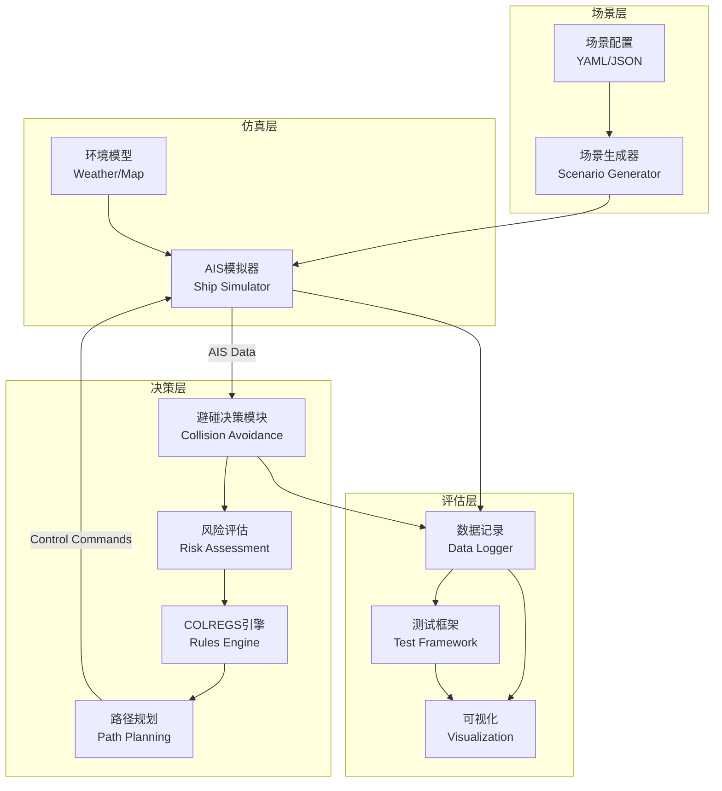

# Design Document: 水路仿真测试框架与智能避碰系统

## Overview

本设计文档描述了一个基于ROS2的船舶避碰仿真测试系统的架构和实现方案。系统由四个核心模块组成：

1. **场景生成器 (Scenario Generator)** - 自动生成各种船舶相遇场景
2. **AIS模拟器 (AIS Simulator)** - 模拟船舶运动和AIS数据发送
3. **避碰决策模块 (Collision Avoidance Module)** - 基于COLREGS规则的智能避碰算法
4. **测试评估框架 (Test Framework)** - 性能评估和数据分析

系统采用模块化设计，各模块通过ROS2话题和服务进行通信，支持分布式部署和扩展。

## Architecture

### 系统架构图



### 数据流

1. **场景初始化流程**
   - 用户通过配置文件定义场景参数
   - 场景生成器解析配置，生成船舶初始状态
   - AIS模拟器加载船舶状态，开始仿真

2. **实时仿真流程**
   - AIS模拟器以1Hz频率发布船舶状态
   - 避碰决策模块订阅AIS数据，计算碰撞风险
   - 当风险超过阈值，触发避让决策
   - 路径规划模块生成避让路径
   - 控制指令发送回模拟器，更新船舶状态

3. **数据记录流程**
   - 数据记录器订阅所有关键话题
   - 实时写入时序数据库
   - 场景结束后导出分析报告

## Components and Interfaces

### 1. 场景生成器 (Scenario Generator)

**职责：** 根据配置参数生成标准化的船舶相遇场景

**接口：**
```python
class ScenarioGenerator:
    def generate_head_on_scenario(self, params: HeadOnParams) -> ScenarioConfig
    def generate_crossing_scenario(self, params: CrossingParams) -> ScenarioConfig
    def generate_overtaking_scenario(self, params: OvertakingParams) -> ScenarioConfig
    def generate_multi_ship_scenario(self, params: MultiShipParams) -> ScenarioConfig
    def generate_emergency_scenario(self, params: EmergencyParams) -> ScenarioConfig
```

**配置参数结构：**
```yaml
scenario:
  type: "head_on"  # head_on, crossing, overtaking, multi_ship
  ships:
    - mmsi: 123456789
      initial_position: [lat, lon]
      heading: 90.0
      speed: 10.0
    - mmsi: 987654321
      initial_position: [lat, lon]
      heading: 270.0
      speed: 12.0
  environment:
    weather: "calm"  # calm, moderate, rough
    visibility: "good"  # good, moderate, poor
    water_area: "open"  # open, restricted, narrow
```

### 2. AIS模拟器 (AIS Simulator)

**职责：** 模拟船舶运动物理模型，生成和发送AIS数据

**ROS2话题：**
- 发布: `/ais/ship_states` (AisShipList)
- 订阅: `/control/commands` (ControlCommand)

**核心功能：**
- 船舶运动学模型（考虑惯性、转向率限制）
- 环境干扰模拟（风、浪、流）
- 电子围栏碰撞检测
- NMEA格式AIS数据编码

### 3. 避碰决策模块 (Collision Avoidance Module)

#### 3.1 风险评估子模块 (Risk Assessment)

**职责：** 计算碰撞风险指标

**核心算法：**
```python
def calculate_dcpa_tcpa(own_ship: ShipState, target_ship: ShipState) -> Tuple[float, float]:
    """
    计算DCPA (最近会遇距离) 和 TCPA (到达最近点时间)
    使用相对运动矢量法
    """
    # 相对位置矢量
    dx = target_ship.lon - own_ship.lon
    dy = target_ship.lat - own_ship.lat
    
    # 相对速度矢量
    dvx = target_ship.vx - own_ship.vx
    dvy = target_ship.vy - own_ship.vy
    
    # TCPA计算
    tcpa = -(dx * dvx + dy * dvy) / (dvx**2 + dvy**2)
    
    # DCPA计算
    if tcpa < 0:
        dcpa = math.sqrt(dx**2 + dy**2)
    else:
        dcpa = math.sqrt((dx + dvx * tcpa)**2 + (dy + dvy * tcpa)**2)
    
    return dcpa, tcpa

def calculate_cri(dcpa: float, tcpa: float, bearing: float, speed_ratio: float) -> float:
    """
    计算综合碰撞风险指数 (CRI)
    考虑距离、时间、方位、速度比等因素
    """
    # 距离因子 (0-1, 距离越近风险越高)
    distance_factor = 1.0 / (1.0 + dcpa / SAFE_DISTANCE)
    
    # 时间因子 (0-1, 时间越短风险越高)
    time_factor = 1.0 / (1.0 + tcpa / SAFE_TIME)
    
    # 方位因子 (考虑相对方位的危险性)
    bearing_factor = calculate_bearing_risk(bearing)
    
    # 速度比因子
    speed_factor = min(speed_ratio, 2.0) / 2.0
    
    # 加权综合
    cri = (0.4 * distance_factor + 
           0.3 * time_factor + 
           0.2 * bearing_factor + 
           0.1 * speed_factor)
    
    return cri
```

#### 3.2 COLREGS规则引擎 (Rules Engine)

**职责：** 识别相遇类型，应用相应的避碰规则

**规则判定逻辑：**
```python
class EncounterType(Enum):
    HEAD_ON = "head_on"          # 对遇 (Rule 14)
    CROSSING = "crossing"         # 交叉相遇 (Rule 15)
    OVERTAKING = "overtaking"     # 追越 (Rule 13)
    NONE = "none"

def determine_encounter_type(own_ship: ShipState, target_ship: ShipState) -> EncounterType:
    """
    根据相对方位和航向判断相遇类型
    """
    relative_bearing = calculate_relative_bearing(own_ship, target_ship)
    heading_diff = abs(own_ship.heading - target_ship.heading)
    
    # 对遇判定：相向航行，航向差接近180度
    if 170 <= heading_diff <= 190 and -10 <= relative_bearing <= 10:
        return EncounterType.HEAD_ON
    
    # 追越判定：从后方22.5度扇形区域内接近
    if relative_bearing > 112.5 or relative_bearing < -112.5:
        if own_ship.speed > target_ship.speed:
            return EncounterType.OVERTAKING
    
    # 交叉相遇：其他情况
    if 5 <= abs(relative_bearing) <= 112.5:
        return EncounterType.CROSSING
    
    return EncounterType.NONE

def apply_colregs_rule(encounter_type: EncounterType, 
                       own_ship: ShipState, 
                       target_ship: ShipState) -> AvoidanceAction:
    """
    根据相遇类型应用COLREGS规则
    """
    if encounter_type == EncounterType.HEAD_ON:
        # Rule 14: 对遇时双方向右转向
        return AvoidanceAction(turn_direction="starboard", turn_angle=15.0)
    
    elif encounter_type == EncounterType.CROSSING:
        # Rule 15/17: 判断让路船和直航船
        if is_give_way_vessel(own_ship, target_ship):
            # 让路船：采取明显避让行动
            return AvoidanceAction(turn_direction="starboard", turn_angle=30.0)
        else:
            # 直航船：保持航向航速
            return AvoidanceAction(maintain_course=True)
    
    elif encounter_type == EncounterType.OVERTAKING:
        # Rule 13: 追越船避让
        return AvoidanceAction(turn_direction="port", turn_angle=20.0)
    
    return AvoidanceAction(no_action=True)
```

#### 3.3 路径规划子模块 (Path Planning)

**职责：** 生成和评估避让路径

**路径生成算法：**
```python
def generate_avoidance_paths(own_ship: ShipState, 
                             target_ships: List[ShipState],
                             environment: Environment) -> List[Path]:
    """
    生成多条候选避让路径
    """
    candidate_paths = []
    
    # 策略1：改变航向（右转15°, 30°, 45°）
    for turn_angle in [15, 30, 45]:
        path = generate_course_change_path(own_ship, turn_angle, "starboard")
        candidate_paths.append(path)
    
    # 策略2：减速避让
    path = generate_speed_reduction_path(own_ship, speed_factor=0.7)
    candidate_paths.append(path)
    
    # 策略3：组合策略（转向+减速）
    path = generate_combined_path(own_ship, turn_angle=20, speed_factor=0.8)
    candidate_paths.append(path)
    
    return candidate_paths

def evaluate_path(path: Path, 
                  target_ships: List[ShipState],
                  colregs_rule: AvoidanceAction) -> PathScore:
    """
    评估路径的安全性、效率和合规性
    """
    # 安全性评分：检查是否引发新的碰撞风险
    safety_score = calculate_safety_score(path, target_ships)
    
    # 效率评分：航程增加和时间延误
    efficiency_score = calculate_efficiency_score(path)
    
    # 合规性评分：是否符合COLREGS规则
    compliance_score = calculate_compliance_score(path, colregs_rule)
    
    # 综合评分
    total_score = (0.5 * safety_score + 
                   0.3 * efficiency_score + 
                   0.2 * compliance_score)
    
    return PathScore(total=total_score, 
                     safety=safety_score,
                     efficiency=efficiency_score,
                     compliance=compliance_score)
```

### 4. 测试评估框架 (Test Framework)

**职责：** 批量运行测试场景，统计性能指标

**核心指标：**
```python
class PerformanceMetrics:
    # 安全性指标
    collision_avoidance_rate: float  # 避碰成功率
    min_encounter_distance: float    # 最小会遇距离
    avg_encounter_distance: float    # 平均会遇距离
    
    # 效率指标
    course_change_count: int         # 航向改变次数
    avg_course_change_angle: float   # 平均改变角度
    path_length_increase: float      # 航程增加百分比
    time_delay: float                # 时间延误（秒）
    
    # 合规性指标
    colregs_compliance_rate: float   # 规则遵守率
    rule_violations: List[str]       # 违规记录
    
    # 鲁棒性指标
    emergency_maneuver_count: int    # 紧急避让次数
    false_alarm_rate: float          # 误报率
```

## Data Models

### 船舶状态数据模型

```python
@dataclass
class ShipState:
    mmsi: int                    # 船舶MMSI
    timestamp: float             # 时间戳
    latitude: float              # 纬度
    longitude: float             # 经度
    heading: float               # 航向 (0-360度)
    course: float                # 航迹向 (0-360度)
    speed: float                 # 对地速度 (节)
    rate_of_turn: float          # 转向率 (度/分钟)
    navigation_status: str       # 航行状态
    
    # 计算属性
    @property
    def vx(self) -> float:
        """东向速度分量"""
        return self.speed * math.sin(math.radians(self.heading))
    
    @property
    def vy(self) -> float:
        """北向速度分量"""
        return self.speed * math.cos(math.radians(self.heading))
```

### 场景配置数据模型

```python
@dataclass
class ScenarioConfig:
    scenario_id: str
    scenario_type: str           # head_on, crossing, overtaking, etc.
    ships: List[ShipState]       # 船舶初始状态列表
    environment: EnvironmentConfig
    duration: float              # 场景持续时间（秒）
    success_criteria: Dict       # 成功判定标准

@dataclass
class EnvironmentConfig:
    weather_condition: str       # calm, moderate, rough
    visibility: str              # good, moderate, poor
    water_area_type: str         # open, restricted, narrow
    wind_speed: float            # 风速 (m/s)
    wind_direction: float        # 风向 (度)
    current_speed: float         # 流速 (m/s)
    current_direction: float     # 流向 (度)
    map_boundaries: Polygon      # 地图边界
```

### 避让决策数据模型

```python
@dataclass
class AvoidanceDecision:
    timestamp: float
    own_ship_mmsi: int
    target_ship_mmsi: int
    encounter_type: EncounterType
    collision_risk: float        # CRI值
    dcpa: float
    tcpa: float
    action: AvoidanceAction
    selected_path: Path
    reason: str                  # 决策理由

@dataclass
class AvoidanceAction:
    action_type: str             # course_change, speed_change, combined, maintain
    turn_direction: Optional[str]  # starboard, port
    turn_angle: Optional[float]
    speed_factor: Optional[float]
    maintain_course: bool = False
    no_action: bool = False
```


## Correctness Properties

*A property is a characteristic or behavior that should hold true across all valid executions of a system-essentially, a formal statement about what the system should do. Properties serve as the bridge between human-readable specifications and machine-verifiable correctness guarantees.*

### Property 1: 场景生成的几何正确性

*For any* 对遇场景配置参数，生成的两艘船舶应满足对遇的几何条件：航向差在170-190度之间，且相对方位在-10到10度之间

**Validates: Requirements 1.1**

### Property 2: 交叉场景的角度约束

*For any* 交叉相遇场景配置参数，生成的两艘船舶的相对方位应在5-112.5度或-112.5到-5度之间

**Validates: Requirements 1.2**

### Property 3: 追越场景的速度和位置关系

*For any* 追越场景配置参数，生成的追越船速度应大于被追越船，且追越船应位于被追越船后方22.5度扇形区域内

**Validates: Requirements 1.3**

### Property 4: AIS数据发送频率

*For any* 运行中的仿真场景，连续两次AIS数据发送的时间间隔应在0.9-1.1秒之间（允许10%误差）

**Validates: Requirements 1.5**

### Property 5: 危险场景的风险参数

*For any* 紧急避让场景配置，生成的初始状态计算出的DCPA应小于0.5海里，TCPA应小于5分钟

**Validates: Requirements 2.1**

### Property 6: DCPA/TCPA计算的对称性

*For any* 两艘船舶状态，从船A视角计算的DCPA/TCPA应等于从船B视角计算的DCPA/TCPA

**Validates: Requirements 4.1**

### Property 7: 对遇规则的转向方向

*For any* 检测到的对遇局面，避碰决策模块输出的转向指令应为向右（starboard）转向

**Validates: Requirements 3.1**

### Property 8: 让路船的明显避让

*For any* 交叉相遇场景中被判定为让路船的情况，避碰决策模块输出的航向改变应大于等于15度

**Validates: Requirements 3.2**

### Property 9: 直航船的航向保持

*For any* 交叉相遇场景中被判定为直航船的情况，在让路船未采取行动前，避碰决策模块应输出保持航向的指令

**Validates: Requirements 3.3**

### Property 10: CRI值的单调性

*For any* 两艘船舶状态，当DCPA减小或TCPA减小时，计算出的CRI值应增加（风险上升）

**Validates: Requirements 4.2**

### Property 11: 风险阈值触发的一致性

*For any* 计算出的CRI值，当CRI超过预警阈值时，系统应发出预警信号；当CRI超过危险阈值时，系统应触发避让决策

**Validates: Requirements 4.3, 4.4**

### Property 12: 路径安全性验证

*For any* 生成的候选避让路径，被选择的最优路径不应与任何目标船舶产生新的碰撞风险（即新的DCPA应大于安全距离）

**Validates: Requirements 5.3**

### Property 13: 路径COLREGS合规性

*For any* 生成的避让路径，在对遇场景中应为右转路径，在交叉场景中让路船应为大角度避让路径

**Validates: Requirements 5.4**

### Property 14: 避让后的返航路径

*For any* 完成避让的船舶，当碰撞风险消除后，系统应规划返回原航线的路径

**Validates: Requirements 5.6**

### Property 15: 数据记录的完整性

*For any* 运行的仿真场景，记录的AIS数据点数应等于场景持续时间（秒）乘以发送频率（1Hz）

**Validates: Requirements 9.1**

### Property 16: 决策记录的时间戳一致性

*For any* 记录的避让决策，决策时间戳应在对应的AIS数据时间戳范围内

**Validates: Requirements 9.2**

### Property 17: 数据导出格式的可解析性

*For any* 导出的数据文件（CSV、JSON、ROS Bag），应能被相应的标准解析器成功解析，且解析后的数据与原始数据一致（round-trip property）

**Validates: Requirements 9.4**

### Property 18: 配置文件的热加载

*For any* 修改后的配置文件，系统应在下一个仿真周期使用新的配置参数

**Validates: Requirements 8.1**

### Property 19: 标准AIS格式的解析

*For any* 符合NMEA 0183标准的AIS消息，系统应能成功解析并提取所有必需字段

**Validates: Requirements 8.4**

### Property 20: 系统启动的依赖检查

*For any* 系统启动过程，如果缺少必需的依赖项或配置文件，系统应报告具体的缺失项并拒绝启动

**Validates: Requirements 10.2**

## Error Handling

### 1. 场景生成错误

**错误类型：**
- 无效的场景参数（如负数速度、超出范围的坐标）
- 不可行的场景配置（如船舶初始位置重叠）

**处理策略：**
- 参数验证：在场景生成前验证所有参数的合法性
- 冲突检测：检查船舶初始位置是否冲突
- 错误报告：提供详细的错误信息和修正建议

### 2. 仿真运行时错误

**错误类型：**
- 船舶碰撞（仿真失败）
- 船舶出界（超出地图边界）
- 数据通信中断

**处理策略：**
- 碰撞检测：实时检测船舶间距离，记录碰撞事件
- 边界检查：防止船舶超出有效区域
- 通信监控：检测ROS2话题的连接状态
- 优雅降级：通信中断时使用最后已知状态

### 3. 避碰决策错误

**错误类型：**
- 无法生成有效避让路径
- 路径评估失败
- 规则冲突（多条规则同时适用）

**处理策略：**
- 后备策略：如果主算法失败，使用保守的紧急避让策略
- 规则优先级：定义清晰的规则优先级顺序
- 日志记录：详细记录决策过程和失败原因

### 4. 数据记录错误

**错误类型：**
- 磁盘空间不足
- 数据库连接失败
- 文件写入权限问题

**处理策略：**
- 空间检查：启动前检查可用磁盘空间
- 连接重试：数据库连接失败时自动重试
- 内存缓冲：临时存储在内存中，等待恢复
- 错误通知：及时通知用户数据记录问题

## Testing Strategy

### 测试方法论

本系统采用**双重测试策略**：

1. **单元测试 (Unit Tests)** - 验证具体示例、边界情况和错误条件
2. **基于属性的测试 (Property-Based Tests)** - 验证通用属性在所有输入下成立

两种测试方法是互补的：
- 单元测试捕获具体的bug和边界情况
- 属性测试通过随机化输入验证通用正确性

### 测试框架选择

**Python生态系统：**
- 单元测试：`pytest`
- 属性测试：`Hypothesis`
- ROS2集成测试：`launch_testing`

**属性测试配置：**
- 每个属性测试最少运行 **100次迭代**
- 每个测试必须标注对应的设计属性
- 标注格式：`# Feature: maritime-collision-avoidance, Property N: [property text]`

### 测试层次

#### 1. 单元测试

**场景生成器测试：**
```python
def test_head_on_scenario_basic():
    """测试基本对遇场景生成"""
    params = HeadOnParams(distance=2.0, speed1=10.0, speed2=12.0)
    scenario = generator.generate_head_on_scenario(params)
    
    assert len(scenario.ships) == 2
    assert abs(scenario.ships[0].heading - scenario.ships[1].heading) > 170

def test_invalid_scenario_params():
    """测试无效参数的错误处理"""
    params = HeadOnParams(distance=-1.0, speed1=10.0, speed2=12.0)
    
    with pytest.raises(ValueError):
        generator.generate_head_on_scenario(params)
```

**DCPA/TCPA计算测试：**
```python
def test_dcpa_tcpa_parallel_ships():
    """测试平行航行船舶的DCPA/TCPA"""
    ship1 = ShipState(lat=0.0, lon=0.0, heading=0, speed=10)
    ship2 = ShipState(lat=0.0, lon=0.01, heading=0, speed=10)
    
    dcpa, tcpa = calculate_dcpa_tcpa(ship1, ship2)
    
    assert dcpa == pytest.approx(0.01, rel=0.01)  # 保持恒定距离
    assert tcpa < 0  # 不会相遇
```

#### 2. 属性测试

**场景生成属性测试：**
```python
from hypothesis import given, strategies as st

@given(
    distance=st.floats(min_value=0.5, max_value=10.0),
    speed1=st.floats(min_value=5.0, max_value=20.0),
    speed2=st.floats(min_value=5.0, max_value=20.0)
)
def test_property_head_on_geometry(distance, speed1, speed2):
    """
    Feature: maritime-collision-avoidance, Property 1: 场景生成的几何正确性
    
    对于任何对遇场景参数，生成的船舶应满足对遇几何条件
    """
    params = HeadOnParams(distance=distance, speed1=speed1, speed2=speed2)
    scenario = generator.generate_head_on_scenario(params)
    
    ship1, ship2 = scenario.ships[0], scenario.ships[1]
    heading_diff = abs(ship1.heading - ship2.heading)
    
    # 验证航向差在170-190度之间
    assert 170 <= heading_diff <= 190 or 170 <= (360 - heading_diff) <= 190

@given(
    ship1=ship_state_strategy(),
    ship2=ship_state_strategy()
)
def test_property_dcpa_symmetry(ship1, ship2):
    """
    Feature: maritime-collision-avoidance, Property 6: DCPA/TCPA计算的对称性
    
    从两个视角计算的DCPA/TCPA应该相等
    """
    dcpa1, tcpa1 = calculate_dcpa_tcpa(ship1, ship2)
    dcpa2, tcpa2 = calculate_dcpa_tcpa(ship2, ship1)
    
    assert dcpa1 == pytest.approx(dcpa2, rel=0.01)
    assert tcpa1 == pytest.approx(tcpa2, rel=0.01)
```

**COLREGS规则属性测试：**
```python
@given(
    own_ship=ship_state_strategy(),
    target_ship=ship_state_strategy().filter(lambda s: is_head_on_situation(own_ship, s))
)
def test_property_head_on_turn_direction(own_ship, target_ship):
    """
    Feature: maritime-collision-avoidance, Property 7: 对遇规则的转向方向
    
    对于任何对遇局面，应输出向右转向指令
    """
    encounter_type = determine_encounter_type(own_ship, target_ship)
    action = apply_colregs_rule(encounter_type, own_ship, target_ship)
    
    assert encounter_type == EncounterType.HEAD_ON
    assert action.turn_direction == "starboard"
```

#### 3. 集成测试

**端到端场景测试：**
```python
def test_integration_head_on_avoidance():
    """测试完整的对遇避让流程"""
    # 1. 生成场景
    scenario = generator.generate_head_on_scenario(HeadOnParams(...))
    
    # 2. 启动仿真
    simulator = AISSimulator(scenario)
    avoidance = CollisionAvoidanceModule()
    
    # 3. 运行仿真
    results = run_simulation(simulator, avoidance, duration=300)
    
    # 4. 验证结果
    assert results.collision_occurred == False
    assert results.min_encounter_distance > SAFE_DISTANCE
    assert results.colregs_compliance == True
```

#### 4. 性能测试

**批量场景测试：**
```python
def test_performance_batch_scenarios():
    """批量运行100个随机场景，统计性能指标"""
    scenarios = [generate_random_scenario() for _ in range(100)]
    
    metrics = []
    for scenario in scenarios:
        result = run_simulation(scenario)
        metrics.append(result.metrics)
    
    # 统计分析
    avg_success_rate = sum(m.collision_avoidance_rate for m in metrics) / 100
    avg_compliance = sum(m.colregs_compliance_rate for m in metrics) / 100
    
    assert avg_success_rate > 0.95  # 95%以上成功率
    assert avg_compliance > 0.90    # 90%以上合规率
```

### 测试数据生成策略

**Hypothesis策略定义：**
```python
from hypothesis import strategies as st

# 船舶状态生成策略
@st.composite
def ship_state_strategy(draw):
    return ShipState(
        mmsi=draw(st.integers(min_value=100000000, max_value=999999999)),
        latitude=draw(st.floats(min_value=-90, max_value=90)),
        longitude=draw(st.floats(min_value=-180, max_value=180)),
        heading=draw(st.floats(min_value=0, max_value=360)),
        speed=draw(st.floats(min_value=0, max_value=30)),
        rate_of_turn=draw(st.floats(min_value=-10, max_value=10))
    )

# 对遇场景生成策略
@st.composite
def head_on_scenario_strategy(draw):
    base_lat = draw(st.floats(min_value=20, max_value=50))
    base_lon = draw(st.floats(min_value=100, max_value=140))
    distance = draw(st.floats(min_value=0.5, max_value=5.0))
    
    ship1 = ShipState(
        mmsi=123456789,
        latitude=base_lat,
        longitude=base_lon,
        heading=90,
        speed=draw(st.floats(min_value=5, max_value=20))
    )
    
    ship2 = ShipState(
        mmsi=987654321,
        latitude=base_lat,
        longitude=base_lon + distance,
        heading=270,
        speed=draw(st.floats(min_value=5, max_value=20))
    )
    
    return ScenarioConfig(ships=[ship1, ship2])
```

### 持续集成

**CI/CD流程：**
1. 代码提交触发自动测试
2. 运行所有单元测试和属性测试
3. 生成测试覆盖率报告（目标：>80%）
4. 运行性能回归测试
5. 生成测试报告和可视化

**测试环境：**
- Docker容器化测试环境
- ROS2 Humble + Python 3.10
- 自动化测试脚本

